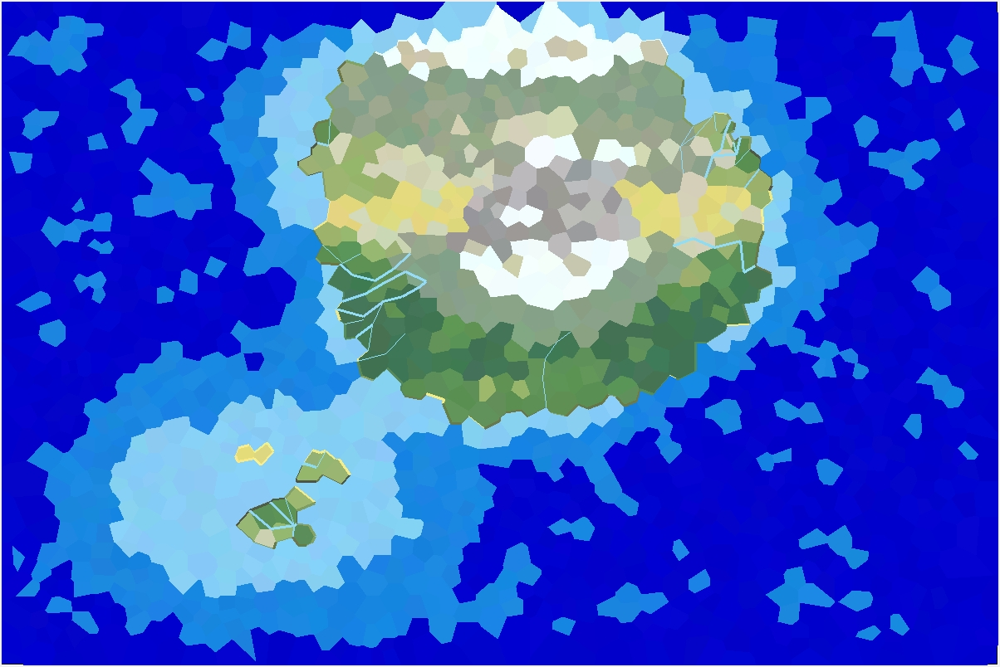
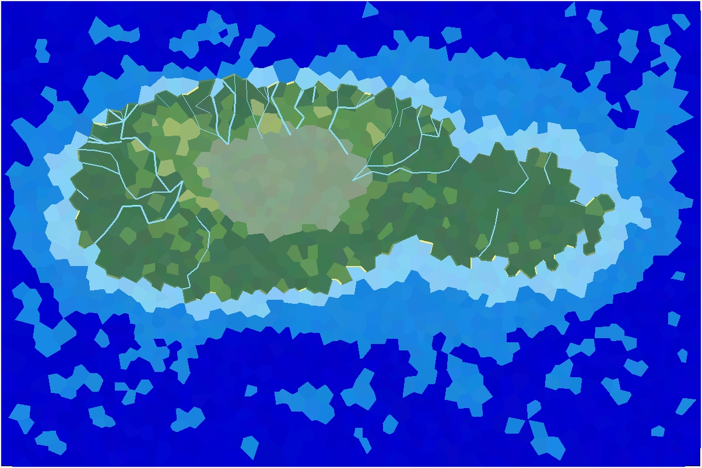
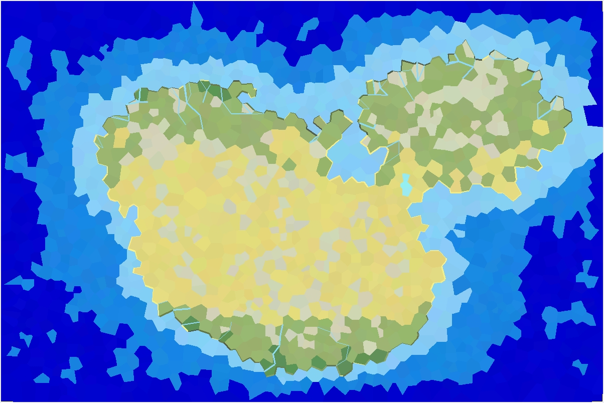
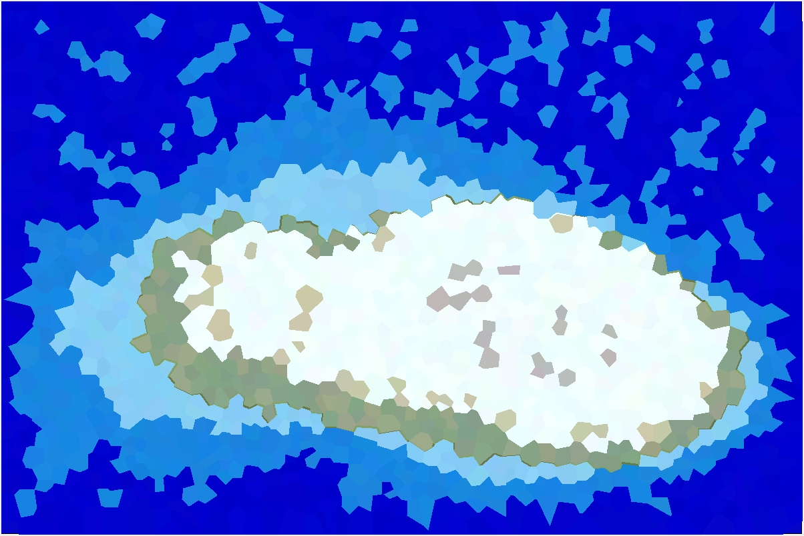

# Map Generation

A python program for polygon map generation based on 2D Voronoi diagrams.

## Usage

```
python Demo.py
```

## Examples






The latitude range of the generated map can be adjusted by modifying the `min_latitude` and `max_latitude` parameters. Besides, more parameters are available for adjusting map generation.

## References

- [Delaunay and Voronoi Tessellation](https://github.com/bennycheung/PyDelaunay)
- [Polygonal Map Generation for Games](http://www-cs-students.stanford.edu/~amitp/game-programming/polygon-map-generation/)
- [程序化随机多边形地图生成](https://www.jianshu.com/p/08e9b772964b)
